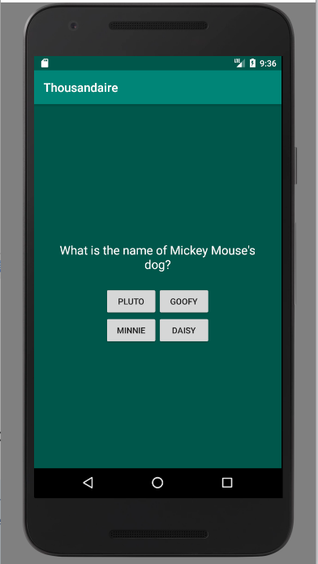
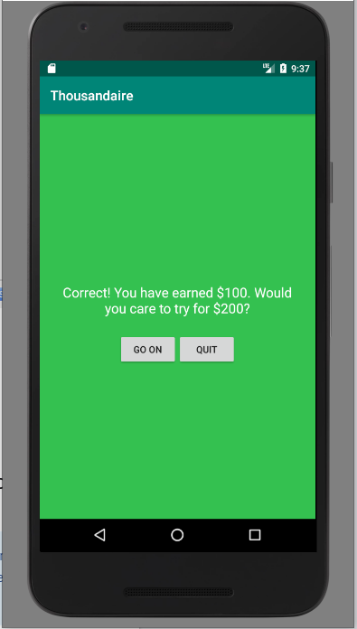
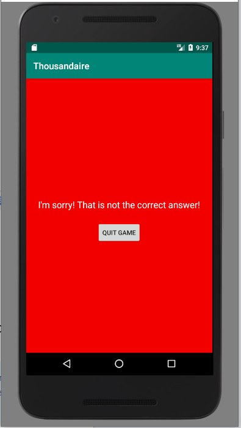
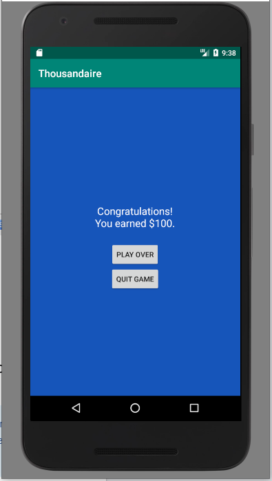

# COP 3665 - Mobile Programming

# Project 1 - Who Wants to Be a Thousandaire?

## Objective:

This project is meant to help you understand the basic framework for working with and developing Android applications. This project has you creating multiple activities to handle a trivia game similar to the game 'Who wants to be a millionaire?' with the primary difference being that we are only focusing on the first six questions of the game. You will need to adhere to the constraints given in this description and ensure that you are completing all objectives. 

## Learning Outcomes:

Develop a mobile program that uses:

- Multiple activities and layouts
- Explicit intents and extras

In addition:

- Gain familiarity with submitting your work through Github (This is a common industry tool and the more comfortable you get with version control before graduating, the better)

## Preparation:

To complete this project, you need to make sure that you have read and watched all material from the first two weeks of the course. You also need to ensure that you have familiarity with concepts covered in Intermediate Programming.

## Problem Description:

You are tasked to create a trivia game that builds upon the discussion from the first two weeks of the class. In this game, players are asked to answer a total of six multiple choice (4 choices each) trivia questions. Answering each question moves the player closer to achieving the ultimate goal of the game of becoming a thousandaire. The first question in the game is worth a total of $100. Reaching the second question in the game awards the player $200. The progression continues with the third question giving the player $300, the fourth question $400, the fifth question $500, and the final question $1000. Note that the amounts are not cumulative, answering the third question is only worth $300, not $600. 

There are two possible outcomes when answering a question. The first outcome is that the player incorrectly answers the question. Incorrect answers show a gameover screen (all activities are shown below) that forces the player to quit the game. The second outcome is that the player answers the question correctly. When a player answers a question correctly, they can choose to either continue playing (Go On) or quit playing. If the player chooses to quit playing, they earn the number of dollars for the question that they stopped at. However, if the player continues to play, they risk losing everything that they have earned up until that point. If a player makes it through all six questions or choose to quit playing after answering a question, a score screen will show asking the player if they wish to play again or if they wish to quit the game. A video is provided to show how gameplay is expected to work.    

## Overview of the Interface:

You must provide four different activities in your program. For each of the activities, you must match the layout, and must use similar colors. You can change the color by using the android:background attribute on the parent layout. Include your colors in your colors.xml. 

The first activity is the main activity that includes your questions and answers. Note that all questions and their answers are provided for you in your repository in the file called questions.txt. You need to copy these questions and answers into your strings.xml file. 

The second activity is the proceed activity which asks the player whether they want to go on and continue or if they would like to quit the game with what they currently have.

The third activity is a gameover activity that forces the player to choose to quit the game. You can close an activity by calling finish(), but you need to also be careful that the player does not avoid a gameover by backing out of the gameover activity. You can check for this by determining which lifecycle methods are called when a player hits the back button and then setting the returned result to RESULT_CANCELED.

The final activity is a score activity that shows the final dollar amount that the player earned and then allows them to either play the over or quit the game. 

### Sample run of program

The image below links to a [video](https://youtu.be/-aqURst9ROM) of a sample execution of the program solution.

## Models:

You will need to make sure that you include the following models. In the video, I have separated the Models into their own Models package. Note that there is some room for interpretation, but a general code outline is given below.
 
### The Game Class

This class is responsible for storing information pertaining to the game in a ViewModel. Each property should provide a getter, but setters should be private.

In addition to a constructor, it has the following methods:
* `addQuestion (questionText, questionAnswer, choices, amount)`
	* Adds a new question to the list of questions. Should be called by your MainActivity.
* `isFinalQuestion ()`
	* Returns whether there are any questions that will follow this one.
* `proceedToNextQuestion ()`
	* Updates the game to the next question.

### The Question Class

This class is responsible for storing information pertaining to a specific question in the game. It should be a Data class. Note that integers are used instead of strings for holding questions and answers. This is a result of strings being referenced by Ids.

## Additional Requirements:

Your application must function as described below:

1. Your program must adhere to the all requirements provided in this description.
2. Your program must perform the functionality displayed in the video.
3. Any constants should be kept inside their appropriate xml files (this includes strings and colors). Two exceptions are possible, setting the text for the proceed screen and setting the text for the score screen. 
4. You must use the questions that are provided to you. This ensures consistency for grading purposes. 

## Important Notes:

- Projects will be graded on whether they correctly solve the problem, and whether they adhere to good programming practices.
- Projects must be received by the time specified on the due date. Projects received after that time will get a grade of zero.
- Do not change the any of the files given to you unless told to. 
- Please review the academic honesty policy.
  - Note that viewing another student's solution, whether in whole or in part, is considered academic dishonesty.
  - Also note that submitting code obtained through the Internet or other sources, whether in whole or in part, is considered academic dishonesty. 

## Submission Instructions:

1. All code must be added and committed to your local git repository *as done in activity one or it may not be graded*.
2. All code must be pushed to the GitHub repository created when you "accepted" the assignment.
   1. After pushing, visit the web URL of your repository to verify that your code is there.
      If you don't see the code there, then we can't see it either.
3. Your code must compile and run in a Pixel 2 emulator *as shown in the lectures or it might not be graded*.
   1. If your program will not compile, the graders will not be responsible for trying to test it.
